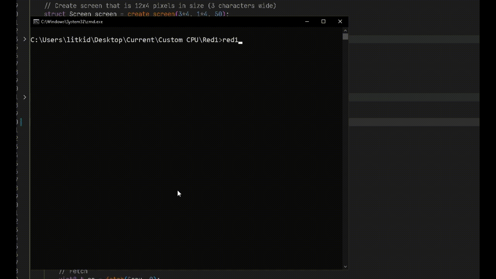

# Red-cpu


First (ish) attempt at a CPU emulator for a custom-designed CPU. The goals of the Red 1 are: 
 - [x] Fully working stack
 - [x] Calculate the Fibonacci sequence
 - [x] Render hexadecimal to a VRAM monitor

Specs: 
 - Memory: 256 bytes
 - Registers: 8, (a, b, c, d, e, f, g, z)
 - Stack pointer (z)
 - Program counter (PC)
 - Fixed instruction size of 4 bytes
 - Only unsigned integers
 - Von Neumann architecture

# Syntax
```
Instruction    = OPCODE a, b, c
TAR            = Target(s) of instruction 
SRC            = Source(s) of instruction 
DST            = Destination of instruction 
ADDR           = Address (Register or RAM)
IMM            = Immediate value
SP             = Stack pointer register
PC             = Program counter
Register       = r[a | b | c | d | e | f | g | z]
RAM            = RAM[address]
```

## Table

#### Memory
| Code | Description                             | Name | a      | b      | c   |
| ---- | --------------------------------------- | ---- | ------ | ------ | --- |
| 0x01 | Sets register to immediate              | SET  | r[TAR] | IMM    |     |
| 0x02 | Moves content from register to register | MOV  | r[SRC] | r[DST] |     |
| 0x03 | Clears content in register              | CLR  | r[TAR] |        |     |
| 0x04 | Load from RAM into register             | GET  | r[DST] | r[SRC] | IMM |
| 0x05 | Store register into RAM                 | STR  | r[SRC] | r[DST] | IMM |
| 0x06 | Outputs register to console             | OUT  | r[SRC] |        |     |
| 0x07 | Load from ROM into register             | ROM  | r[DST] | r[SRC] | IMM |
| 0x08 | Prints emulator RAM to console          | RAM  |        |        |     |

#### Arithmetic
| Code | Description                            | Name | a       | b       | c      |
| ---- | -------------------------------------- | ---- | ------- | ------- | ------ |
| 0xa1 | Adds an immediate to a register        | ADI  | r[TAR]  | IMM     | r[DST] |
| 0xa2 | Adds 2 registers                       | ADD  | r[SRC1] | r[SRC2] | r[DST] |
| 0xa3 | Subtracts an immediate from a register | SUI  | r[TAR]  | IMM     | r[DST] |
| 0xa4 | Subtracts a register from a register   | SUB  | r[SRC1] | r[SRC2] | r[DST] |
| 0xa5 | Bitwise AND gate                       | AND  | r[SRC1] | r[SRC2] | r[DST] |
| 0xa6 | Bitwise OR gate                        | OR   | r[SRC1] | r[SRC2] | r[DST] |
| 0xa7 | Bitwise XOR gate                       | XOR  | r[SRC1] | r[SRC2] | r[DST] |
| 0xa8 | Bitwise NOT gate                       | NOT  | r[SRC]  | r[DST]  |        |
| 0xa9 | Bitwise shift left                     | SHL  | r[SRC]  | IMM     | r[DST] |
| 0xaa | Bitwise shift right                    | SHR  | r[SRC]  | IMM     | r[DST] |
| 0xab | Less than comparison                   | LT   | r[SRC1] | r[SRC2] | r[DST] |
| 0xac | Greater than comparison                | GT   | r[SRC1] | r[SRC2] | r[DST] |
| 0xad | Equal comparison                       | EQ   | r[SRC1] | r[SRC2] | r[DST] |
| 0xae | Not equal comparison                   | NE   | r[SRC1] | r[SRC2] | r[DST] |

#### Control
| Code | Description                                                       | Name | o1     | o2      | o3      |
| ---- | ----------------------------------------------------------------- | ---- | ------ | ------- | ------- |
| 0xb1 | No operation                                                      | NOP  |        |         |         |
| 0xb2 | Stops CPU                                                         | HLT  |        |         |         |
| 0xb3 | Jumps to immediate address, PC = ADDR                             | JMP  | ADDR   |         |         |
| 0xb4 | Jumps to immediate address if r[src] == immediate                 | JEI  | ADDR   | r[SRC]  | IMM     |
| 0xb5 | Jumps to immediate if a r[src1] == r[src2]                        | JER  | ADDR   | r[SRC1] | r[SRC2] |
| 0xb6 | Jumps to register stored address, PC = r[SRC]                     | JMPR | r[SRC] |         |         |
| 0xb7 | Jumps to register stored immediate address if r[src] == immediate | JEIR | r[SRC] | r[SRC]  | IMM     |
| 0xb8 | Jumps to register stored immediate if a r[src1] == r[src2]        | JERR | r[SRC] | r[SRC1] | r[SRC2] |

#### Stack
| Code | Description                                   | Name | a      | b | c |
|------|-----------------------------------------------|------|--------|---|---|
| 0xc1 | Pushes reg[a] to stack, lowers stack          | PUSH | reg[a] |   |   |
| 0xc2 | Raises stack, sends value to reg[a]           | POP  | reg[a] |   |   |
| 0xc3 | Pushes next PC step to stack, sets PC to ADDR | CALL | ADDR   |   |   |
| 0xc4 | Pops -> PC                                    | RET  |        |   |   |

# Running custom programs
First, write assembly code inside the programs/asm directory. Then, cd into the assembler folder and run ```node assemble.js my_program.asm```. It will print the hexadecimal in the console and also write to a ```my_program.raw``` file. Then, go into main.c located in src and copy and paste the assembly into the ```uint8_t program[]``` array, run ```build``` and then run the ```red1.exe```. 

I know this is extremely tedious but this was just my first iteration of a custom CPU in C. Also my first real program in C. My next CPU, *blue-cpu*, will be able to read the ```.raw``` files. 